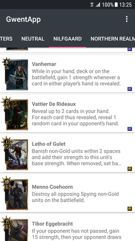

## Synopsis

A sample project based on MVP, Dagger 2 for Dependency Injection, Retrofit (comboed with Rx) for Networking and Realm database.
Uses an open source API to fetch data, store it in the database and present it to the user.

## Motivation

Projects I professionally work on rarely allow me to try out MVP, Dagger 2 and other Android goodies.
Gwent API used by the app was presented on Reddit a while ago and I couldn't resist trying it out.

## API Reference

App uses the following API: https://gwent-api.herokuapp.com/

## Disclaimer
GWENT®: The Witcher Card Game is copyrighted by CD Projekt RED. 
